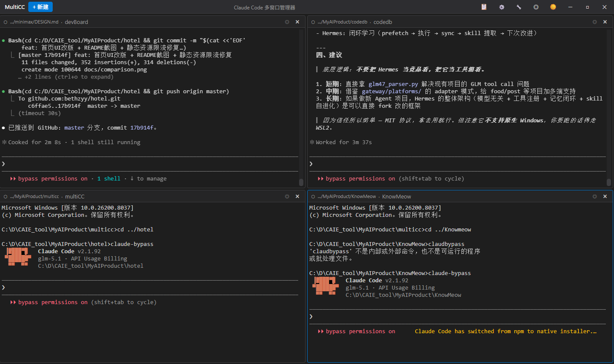

# MultiCC - Claude Code 多窗口管理器

Windows 版 Claude Code 多终端管理器，基于 Electron + React + TypeScript + XTerm.js。



## 功能特性

- **多终端管理**: 同时运行多个 Claude Code 实例
- **平铺布局**: 自动排列终端窗口
- **聚焦模式**: 一键放大当前终端
- **会话存档**: 保存对话历史，支持续聊
- **工作目录快捷方式**: 快速在指定目录启动终端

## 快速开始

### 方式一：使用启动脚本（推荐）

双击 `start.bat` 即可启动。

### 方式二：命令行启动

```bash
# 安装依赖（首次运行）
npm install --ignore-scripts

# 开发模式
npm run dev

# 构建
npm run build

# 构建 Windows 可执行文件
npm run build:win
```

## 快捷键

| 快捷键 | 功能 |
|--------|------|
| `Ctrl+Shift+N` | 新建终端 |
| `Ctrl+W` | 关闭当前终端 |
| `Ctrl+Tab` | 切换终端 |
| `F11` | 切换聚焦模式 |

## 目录结构

```
multicc/
├── src/
│   ├── main/           # Electron 主进程
│   │   ├── index.ts    # 入口
│   │   └── services/   # 服务（PTY、配置、存储）
│   ├── preload/        # 预加载脚本
│   └── renderer/       # React 渲染进程
│       ├── components/ # UI 组件
│       └── styles/     # CSS 样式
├── resources/          # 应用图标
├── start.bat           # 启动脚本
└── package.json        # 项目配置
```

## 技术栈

| 组件 | 技术 |
|------|------|
| 框架 | Electron 34 |
| UI | React 19 |
| 语言 | TypeScript 5.9 |
| 终端 | XTerm.js 5 |
| PTY | @lydell/node-pty |
| 构建 | electron-vite, electron-builder |

## 配置

配置文件位于 `%APPDATA%/multicc/config.json`:

```json
{
  "claudePath": "claude",
  "workingDirs": ["C:\\Projects"],
  "theme": "dark",
  "fontSize": 14
}
```

## 会话存档

会话数据存储在 `%APPDATA%/multicc/sessions/` 目录，每个会话保存为独立的 JSON 文件。

## 开发

```bash
# 开发模式（热重载）
npm run dev

# 构建
npm run build

# 预览构建结果
npm run preview
```

## 故障排除

### 终端无法启动

确保系统有可用的 shell（cmd.exe 或 PowerShell）。

### 依赖安装失败

尝试手动安装：
```bash
npm install --ignore-scripts
```

## 许可证

MIT License
